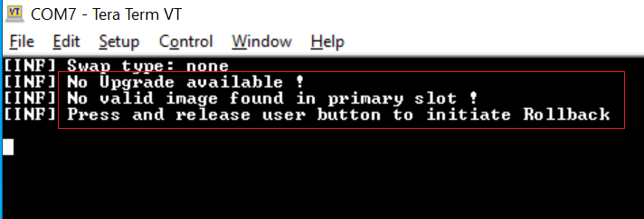
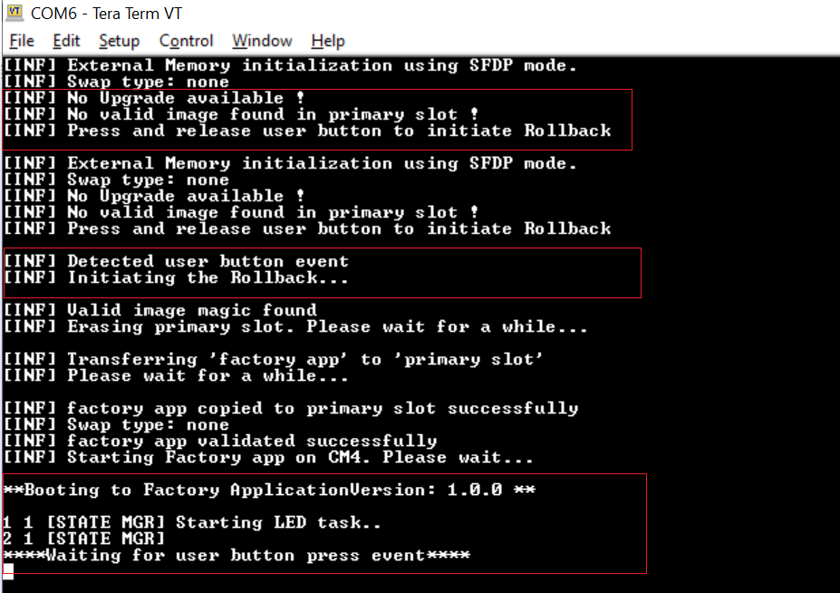
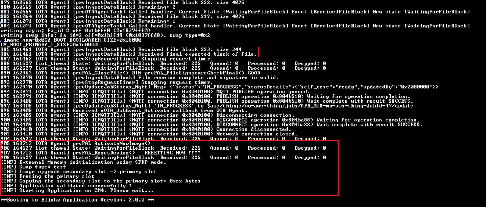
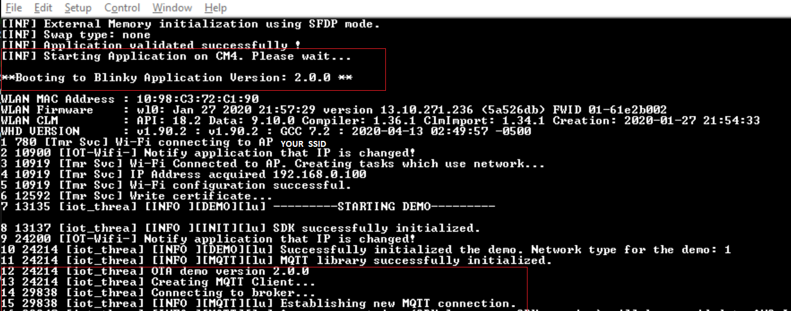
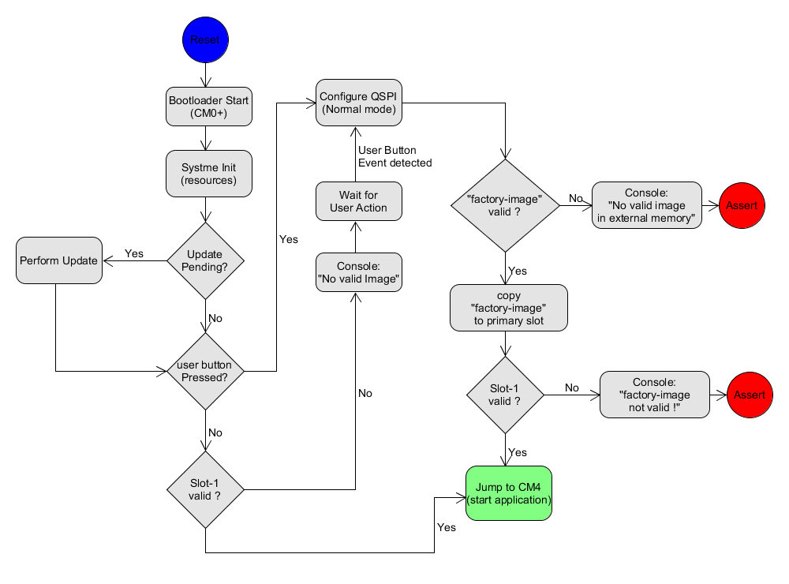
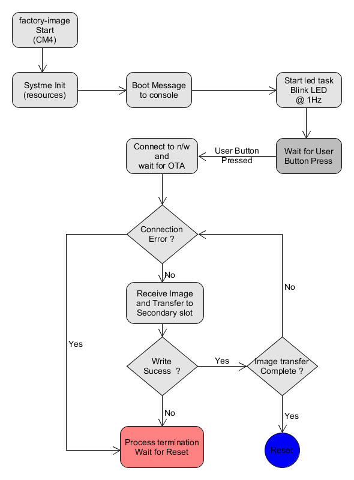
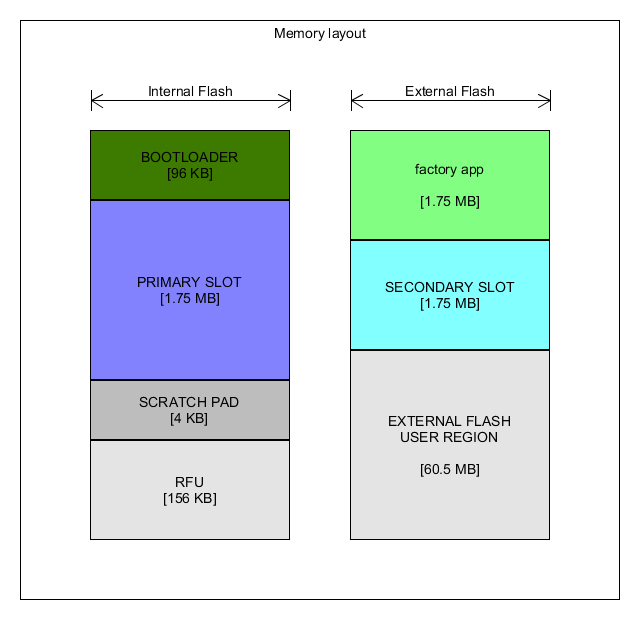

# AWS IoT and FreeRTOS for PSoC 6 MCU: MCUboot-Based Bootloader with Rollback to Factory Image in External Flash

This code example implements a bootloader based on [MCUboot](https://juullabs-oss.github.io/mcuboot/) to demonstrate a rollback to a known good image ('factory_cm4') in case of unrecoverable error conditions with the application that is currently running.

In this example, the bootloader can load the factory image from a known location in the external memory by directly copying it into the primary slot in the internal flash, based on user inputs during boot. The factory image can then perform the OTA upgrade process to download an image over Wi-Fi and place it to the secondary slot of MCUboot.

This code example includes the following applications:

**bootloader_cm0p:** The bootloader is a tiny app based on [MCUboot](https://juullabs-oss.github.io/mcuboot/). This is the first application to start on every reset, and runs entirely on the CM0+ CPU. It is responsible for validating and authenticating the firmware images in the primary and secondary slots, performing necessary upgrades, and booting the CM4 CPU. The bootloader decides the application to run on the CM4 CPU (*blinky_cm4* or *factory_cm4*) depending on the state of the primary slot and user events. See the [MCUboot-based Basic Bootloader](https://github.com/cypresssemiconductorco/mtb-example-psoc6-mcuboot-basic) example first to understand the basics.

**blinky_cm4:** This application is designed to run on the CM4 CPU of PSoC® 6 MCU. At present, this is a tiny FreeRTOS application that blinks the LED at different rates based on build-time configurations and built-in capabilities of OTA upgrade. On a successful build, a binary file is generated, which is used to demonstrate OTA firmware upgrades.

**factory_cm4:** The factory app is a 'golden image' that the bootloader can always trust and fall back on. This FreeRTOS application is built to be placed in the external flash. The bootloader application transfers it to the primary slot for execution. See [Design and Implementation](#design-and-implementation).

## Requirements

- [ModusToolbox® software](https://www.cypress.com/documentation/software-and-drivers/modustoolbox-software-archives) v2.1

- Programming Language: C

- [ModusToolbox FreeRTOS SDK](https://github.com/cypresssemiconductorco/amazon-freertos)

- [Cypress Programmer](https://www.cypress.com/documentation/software-and-drivers/cypress-programmer-archive)

- [Python 3.8.3](https://www.python.org/downloads/release/python-383/).

- [OpenSSL 1.0.2](https://www.openssl.org/source/old/1.0.2/)

If you are using CMake, ensure that you have the following installed. This code example was tested with CMake version 3.18.0 and Ninja version 1.9.0.

- [CMake 3.18.0](https://cmake.org/download/)

- [Ninja 1.9.0](https://ninja-build.org/)

- Associated Parts: All [PSoC 6 MCU](http://www.cypress.com/PSoC6) parts with FreeRTOS support

## Supported Toolchains (make variable 'TOOLCHAIN')

- GNU Arm® Embedded Compiler v7.2.1 (GCC_ARM) - Default value of `TOOLCHAIN`

## Supported Kits (make variable 'TARGET')

- [PSoC 6 Wi-Fi BT Prototyping Kit](https://www.cypress.com/CY8CPROTO-062-4343W) (CY8CPROTO-062-4343W) - Default target

- [PSoC 62S2 Wi-Fi BT Pioneer Kit](https://www.cypress.com/CY8CKIT-062S2-43012) (CY8CKIT-062S2-43012)

## Hardware Setup

This example uses the board's default configuration. See the kit user guide to ensure that the board is configured correctly.

**Note:** ModusToolbox software requires KitProg3. Before using this code example, make sure that the board is upgraded to KitProg3. The tool and instructions are available in the [Firmware Loader](https://github.com/cypresssemiconductorco/Firmware-loader) GitHub repository.

If you do not upgrade, you will see an error like "unable to find CMSIS-DAP device" or "KitProg firmware is out of date".

## Software Setup

1. Install a terminal emulator if you don't have one. Instructions in this document use [Tera Term](https://ttssh2.osdn.jp/index.html.en).

2. Install a Python Interpreter. This code example is tested with [Python 3.8.3](https://www.python.org/downloads/release/python-383/).

### Configure Python

1. Install [Python 3.8.3](https://www.python.org/downloads/release/python-383/) if you don't have it installed on your PC.

2. Change your directory to *\<amazon-freertos>/projects/cypress/afr-example-mcuboot-rollback/common/scripts*.

3. Install the packages listed in *requirements.txt*.
    ```
    pip install -r requirements.txt
    ```
**Note:** *\<amazon-freertos>* refers to the path of the FreeRTOS directory in your computer.

### Configure AWS CLI

AWS CLI is installed as part of the steps in the [Configure Python](#configure-python) section. This example requires AWS CLI to be configured on the local machine to start the OTA update job.

1. Enter the following command to configure your Identity and Access Management credentials with AWS CLI:
   ```
   aws configure --profile <name_of_profile>
   ```
   If no profile name is provided, the credentials are stored with the profile name as `default`.

   Make a note of the “profile” generated. You will need them to generate a signing key pair and perform the OTA job explained in [Step-by-Step Instructions](#step-by-step-instructions), Step 8.

2. Enter your Access Key ID, AWS Secret Access Key, Region, and Output format.

   Ask your AWS account administrator if you do not have these details.

   - See [Region and Availability Zones](https://docs.aws.amazon.com/AmazonRDS/latest/UserGuide/Concepts.RegionsAndAvailabilityZones.html) to find the list of available regions.

   - See [CLI usage output](https://docs.aws.amazon.com/cli/latest/userguide/cli-usage-output.html) to find the supported output formats.

 **Note:** You can also submit the OTA job manually through the web console. See the "OTA Update Prerequisites" and "OTA Tutorial" sections in [FreeRTOS Over-the-Air Updates](https://docs.aws.amazon.com/freertos/latest/userguide/freertos-ota-dev.html).

## Using the Code Example

### In Eclipse IDE for ModusToolbox:

1. Go to **File** > **Import**.

2. Choose **Existing Projects into Workspace** under **General** and click **Next**.

3. Click the **Browse** button near **Select root directory**, choose the code example directory *\<amazon-freertos>/projects/cypress/afr-example-mcuboot-rollback/<app name>*, and click **Finish**.

4. Select the application project in the Project Explorer.

5. In the **Quick Panel**, scroll down, and click **<app name> Build (KitProg3)**.

See [Running FreeRTOS Code Examples - KBA228845](https://community.cypress.com/docs/DOC-18934) for more details.

### In Command-line Interface (CLI) Using Make build:

1. Download and unzip this repository onto your local machine, or clone the repository.

2. Open a CLI terminal and navigate to the application folder.

   On Linux and macOS, you can use any terminal application. On Windows, navigate to the modus-shell directory (*{ModusToolbox install directory}/tools_\<version>/modus-shell*) and run *Cygwin.bat*.

3. Navigate to each application and execute the `make build` command to build with default configurations.

    ```
    cd bootloader_cm0p
    make build
    ```
    ```
    cd blinky_cm4
    make build
    ```
    ```
    cd factory_cm4
    make build
    ```

### Using CMake build:

1. Download and unzip this repository onto your local machine, or clone the repository.

2. Open a CLI terminal and navigate to the application folder.

   On Linux and macOS, you can use any terminal application. On Windows, navigate to the modus-shell directory (*{ModusToolbox install directory}/tools_\<version>/modus-shell*) and run *Cygwin.bat*.

3. Navigate to each application and run the following commands to build applications using CMake:

   `cd <application>`

   `cmake -DVENDOR=cypress -DBOARD=<TARGET> -DCOMPILER=<compiler> -S . -B <build location> -G Ninja -DAFR_TOOLCHAIN_PATH=<toolchain path>`

   `cmake --build <build location>`

### Prerequisites

#### Fetch the Source Code

1. Clone recursively or download the Cypress FreeRTOS SDK from [GitHub](https://github.com/cypresssemiconductorco/amazon-freertos).

   ```
   git clone --recursive https://github.com/cypresssemiconductorco/amazon-freertos.git --branch 202007-MTBAFR2041
   ```

2. Go to *\<amazon-freertos>/projects/cypress* directory. Clone or download this code example, or copy it if you already have it.
    ```
    git clone https://github.com/cypresssemiconductorco/afr-example-mcuboot-rollback.git --recurse-submodules
    ```
   Alternatively, you can clone the example outside of the *\<amazon-freertos>* directory. However, you must make sure that `CY_AFR_ROOT` in *bootloader_cm0p/app.mk*, *blinky_cm4/Makefile*, and *factory_cm4/Makefile*, point to the correct path of *\<amazon-freertos>* directory.

   If you use Eclipse IDE for ModusToolbox, you must clone the code example under *\<amazon-freertos>/projects/cypress* because Eclipse project files use relative paths to link to the files under *\<amazon-freertos>*.

#### Configure AWS

##### If you haven't created a Thing:

1. Update *configure.json* in *\<amazon-freertos>/tools/aws_config_quick_start* with the following details:

   - Name of your Thing
   - SSID, password, and security details of the AP

2. Open a command prompt and run the following command:
    ```
    SetupAWS.py setup
    ```
   Your details will be updated automatically in *aws_credential.h* and *aws_credentialkeys.h* at *\<amazon-freertos>/demos/include*.

3. Copy these files into *\<amazon-freertos>/projects/cypress/afr-example-mcuboot-rollback/common/include*.

   **Note:** See [this](https://docs.aws.amazon.com/cli/latest/reference/iot/create-thing.html) AWS documentation for details on creating a Thing.

##### If you already have created a Thing:

1. Open *aws_credential.h* in *\<amazon-freertos>/projects/cypress/afr-example-mcuboot-rollback/common/include* and update the following:

   - SSID, password, and security details of your AP
   - Name of your Thing
   - Endpoint address

2. Open *aws_credentialkeys.h* in *\<amazon-freertos>/projects/cypress/afr-example-mcuboot-rollback/common/include* and update the security certificates for your Thing.

#### Generate a Signing Key Pair

The OTA job needs a signing profile to sign the image before streaming it to the kit. The signing process is handled by AWS. Both Blinky and Factory applications share the common configurations under *\<amazon-freertos>/projects/cypress/afr-example-mcuboot-rollback/common/*.

Do the following to generate a new signing key-pair and register it with AWS:

1. Open a command prompt and change the directory to *\<amazon-freertos>/projects/cypress/afr-example-mcuboot-rollback/common/script*.

   Replace *\<filename>* with a name of your choice.

2. Generate the private key using the following command:
    ```
    openssl genpkey -algorithm EC -pkeyopt ec_paramgen_curve:P-256 -pkeyopt ec_param_enc:named_curve -outform PEM -out <filename>.pem
    ```
3. Create a new file *cert_config.txt* in the same directory with the following contents. Modify *\<user_name>* and *\<domain>* to match your credentials.

    ```
    [ req ]
    prompt             = no
    distinguished_name = my_dn

    [ my_dn ]
    commonName = <user_name>@<domain>.com

    [ my_exts ]
    keyUsage         = digitalSignature
    extendedKeyUsage = codeSigning
    ```
4. Generate a code-signing certificate using the following command:
    ```
    openssl req -new -x509 -config cert_config.txt -extensions my_exts -nodes -days 365 -key <filename>.pem -out <filename>.crt
    ```
5. Paste the contents of *\<filename>.crt* in *aws_ota_codesigner_certificate.h* at *\<amazon-freertos>/projects/cypress/afr-example-mcuboot-rollback/common/include*.

   Follow the format explained in the file. This is used to verify the signature generated by AWS and streamed with the image to the kit.

6. Register the certificate and private key with AWS Certificate Manager (ACM):
    ```
    aws acm import-certificate --certificate fileb://<filename>.crt --private-key fileb://<filename>.pem --profile <profile_name> > ./certarn.json
    ```
    **Note:** Make sure that you include the output redirect symbol '>' between file names.

## Operation

This example bundles three applications - the bootloader app run by CM0+ CPU, the factory app, and the blinky app run by CM4 CPU. You need to build and program the applications in the following order. Do not start building the applications yet: follow the [Step-by-Step Instructions](#step-by-step-instructions).

1. **Build and program the Bootloader app** - On next reset, CM0+ runs the bootloader app and prints a message that no valid image has been found.

2. **Build Blinky app in UPGRADE (default) mode** - A binary will be generated on successful build, which will be used for OTA demonstration.

3. **Build and program the Factory app to external flash** - By default, the *factory_cm4* application is built for the external flash. Program it to the external NOR flash. Follow the bootloader instructions to initiate a rollback using the user button.

4. **Perform OTA to boot to Blinky app** - Trigger the OTA from the AWS console when the *factory_cm4* app is running on the device. The device must be connected to the network to start the OTA. Once the OTA download is successful, the device will reset and transfer the control to the bootloader for further action.

**Note:** Refer [this](https://github.com/cypresssemiconductorco/afr-example-ota) code example for design details of Over The Air.

### Step-by-Step Instructions

1. Connect the board to your PC using the provided USB cable through the KitProg3 USB connector. Open a terminal program and select the KitProg3 COM port. Set the serial port parameters to 8N1 and 115200 baud.

2. Build and program the Bootloader.

   - **Using Eclipse IDE for ModusToolbox:**

      1. Select the *bootloader_cm0p* application in the Project Explorer.

      2. Open the Makefile and change `EN_XMEM_PROG=1` to enable external memory programming abilities in bootloader.

         See [PSoC 6 MCU Programming Specifications](https://www.cypress.com/documentation/programming-specifications/psoc-6-programming-specifications) for more details.

      3. In the **Quick Panel**, scroll down, and click **\<Application Name> Program (KitProg3)**.

   - **Using Make Build in CLI:**

      1. From the terminal, run the following command to enable external memory programming abilities in bootloader:

         ```
         export EN_XMEM_PROG=1
         ```

      2. Go to the *bootloader_cm0p* directory and execute the `make program` command to build and program the application using the default toolchain to the default target.

         You can specify a target and toolchain manually using the following command:
         ```
         make program TARGET=<BSP> TOOLCHAIN=<toolchain>
         ```

         Example:
         ```
         make program TARGET=CY8CPROTO-062-4343W TOOLCHAIN=GCC_ARM
         ```

     After programming, the *bootloader* application starts automatically. Confirm that the UART terminal displays the following message. Note that both secondary and external memory slots do not contain any valid image at this stage.

     **Figure 1. Bootloader Starting with No Bootable Image**

     

    **Notes:**

      1. You can use DAPLink to program the external memory if you haven't enabled `EN_XMEM_PROG`. See [ExternalMemory.md](https://github.com/JuulLabs-OSS/mcuboot/blob/master/boot/cypress/MCUBootApp/ExternalMemory.md) for details.

      2. Currently, CMake build is not supported for bootloader.

3. Build and program the factory application.

    - **Build the Application:**

        - **Using Eclipse IDE for ModusToolbox:**

            1. Select the *factory_cm4* application in the Project Explorer.

            2. In the **Quick Panel**, scroll down, and click **\<Application Name> Build (KitProg3)**.

        - **Using Make Build in CLI:**

            From the terminal, go to the *factory_cm4* directory and execute the `make build` command to build the application using the default toolchain to the default target.

            You can specify a target and toolchain manually using the following command:
            ```
            make build TARGET=<BSP> TOOLCHAIN=<toolchain>
            ```

            Example:
            ```
            make build TARGET=CY8CPROTO-062-4343W TOOLCHAIN=GCC_ARM
            ```

        - **Using CMake build:**

          To build the factory application using CMake, run the following commands. You will have to select the `TARGET` and `TOOLCHAIN` explicitly. See the [Using CMake build](#using-cmake-build) section.

          `cd amazon-freertos/projects/cypress/afr-example-mcuboot-rollback/factory_cm4`

          `cmake -DVENDOR=cypress -DBOARD=CY8CPROTO_062_4343W -DCOMPILER=arm-gcc -S . -B ../../../../build/factory_cm4 -G Ninja -DAFR_TOOLCHAIN_PATH=c:/User/<USERNAME>/ModusToolbox/tools_2.1/gcc-7.2.1/bin`

          `cmake --build ../../../../build/factory_cm4`

    - **Program the Application:**
    
        Once the build is successful, program the generated hex file (<app name>.hex) using [Cypress Programmer](https://www.cypress.com/documentation/software-and-drivers/cypress-programmer-archive).

4. Build the Blinky app in UPGRADE mode.

    Note that, by default, `IMG_TYPE` is set to `UPGRADE` in *blinky_cm4/Makefile* and *blinky_cm4/CMakeLists.txt*.

    - **Using Eclipse IDE for ModusToolbox:**

      1. Select the `blinky_cm4` application in the Project Explorer.

      2. In the **Quick Panel**, scroll down, and click **\<Application Name> Build (KitProg3)**.

   - **Using Make Build in CLI:**

     From the terminal, go to the *blinky_cm4* directory and execute the `make build` command. You can specify a target and toolchain manually using following command.
      ```
      make build TARGET=<BSP> TOOLCHAIN=<toolchain>
      ```

      Example:
      ```
      make build TARGET=CY8CPROTO-062-4343W TOOLCHAIN=GCC_ARM
      ```

   - **Using CMake build:**

      To build the factory application using CMake, run the following commands. You will have to select the `TARGET` and `TOOLCHAIN` explicitly. See the [Using CMake build](#using-cmake-build) section.

      `cd amazon-freertos/projects/cypress/afr-example-mcuboot-rollback/blinky_cm4`

      `cmake -DVENDOR=cypress -DBOARD=CY8CPROTO_062_4343W -DCOMPILER=arm-gcc -S . -B ../../../../build/blinky_cm4 -G Ninja -DAFR_TOOLCHAIN_PATH=c:/User/<USERNAME>/ModusToolbox/tools_2.1/gcc-7.2.1/bin`

      `cmake --build ../../../../build/blinky_cm4`

**Note:** A binary file *\<APPNAME>.bin* will be generated at the end of successful build, which will be used in subsequent steps for the OTA upgrade.

5. Initiate rollback to the factory app using the user button.

   At this point, both primary and secondary slots are empty. The bootloader reports that both the slots are empty and waits for the user action, as shown in Figure 1.

   Press and release the user button to initiate rollback.

   The bootloader detects the *factory_cm4* application in the external flash, copies it to primary slot, validates it, and starts the application on CM4. On a successful boot, the *factory_cm4* application will boot to the console and start blinking the user LED at a 1-Hz rate.

   **Figure 2. Rollback to *factory_cm4* when Both Primary and Secondary Slots Are Empty**

   

6. Download the blinky application to the bootloader's secondary slot (using the OTA capabilities of the factory app).

   1. Press and release the user button to start the OTA upgrade process. The device will initialize the Wi-Fi module and establish a connection with the designated MQTT server (AWS).

   2. Run the *start_ota.py* Python script at *\<amazon-freertos>/projects/cypress/afr-example-mcuboot-rollback/common/scripts* to create the OTA job.

      Replace *\<name_of_profile>*, *\<name_of_thing>*, *\<name_of_role>*, *\<name_of_s3_bucket>*, and *\<name_of_signing_profile>* to match your credentials.

      ```
      cd dev/amazon-freertos/projects/cypress/afr-example-mcuboot-rollback/common/scripts
      python3 start_ota.py --profile <name_of_profile> --name <name_of_thing> --role <name_of_role> --s3bucket <name_of_s3_bucket> --otasigningprofile <name_of_signing_profile> --appversion <version_in_the_form_3-2-1>
      ```
   Once the device receives an OTA notification, it requests the updated image. AWS creates a stream and transfers the image to the device. A sample serial output is shown in Figure 3.

   **Figure 3. OTA Notification Terminal Output**

   

   After downloading the image to the secondary slot, the OTA Agent on the device verifies the signature provided by AWS with the image. If a valid signature is found, it resets the device; the bootloader will take over from there.

   The bootloader validates the image with the public key. After successfully validating, the bootloader overwrites the image in the primary slot (which contains the factory image) with the secondary slot (which contains the update image) and transfers the control to upgraded firmware.

   The LED now blinks at 4 Hz as shown:

   **Figure 4. Booting the Blinky App**

   

   **Note:** After booting the update image, the version of the image is checked by the OTA Agent. If the version is not newer than the factory image, the OTA Agent rejects the image and forces a reset of the device. Because the factory image is lost after overwriting, the device boots the update image again. **Therefore, you must ensure that the version of the update image is always newer than the image already running on the device.**

## Debugging

You can debug all the examples and step through the code. In the IDE, use the **\<Application Name> Debug (KitProg3)** configuration in the **Quick Panel**. For more details, see the "Program and Debug" section in the Eclipse IDE for ModusToolbox User Guide: *{ModusToolbox install directory}/ide_{version}/docs/mt_ide_user_guide.pdf*.

## Design and Implementation

### Overview

This example bundles three applications: the bootloader app, blinky app, and factory app. By default, the blinky app is built in UPGRADE mode to demonstrate the OTA upgrade process. The factory app is built to be placed in the external memory. The bootloader copies it to the internal flash when a rollback is initiated. It runs entirely from the internal flash.

### Bootloader Implementation

The bootloader is designed based on the MCUboot repo in [GitHub](https://github.com/mcu-tools/mcuboot/tree/v1.6.1-cypress). It is customized in this example to support the rollback feature.

**Figure 5. bootloader_cm0p Implementation Overview**



#### Rollback when Both Primary and Secondary Slots Are Invalid

On bootup, the bootloader checks both primary and secondary slots, and determines whether a valid image is present. If both slots are empty or invalid, the bootloader displays a message on the console that there are no valid images in either slot.

You can press and release the user button to initiate the rollback as instructed in **Step 5** (*Initiate Rollback to the Factory App*) under the [Step-by-Step Instructions](#step-by-step-instructions) section.

#### Rollback when Primary Slot Is Valid and Secondary Slot Is Invalid

If the primary slot is valid and no upgradable image is present in the secondary slot, the bootloader boots to the primary slot on reset.  Instead of booting the application, press and hold the user button during the boot until the 'Rollback Initiated' message is seen on the console to initiate a rollback.

If the device has already booted to the application in the primary slot, you can initiate rollback by holding the user button pressed and then initiating a reset. In both cases, you must hold the user button pressed during the boot for approximately 5 seconds until you observe the 'Rollback Initiated' message on the console.

#### Rollback when Secondary Slot Has a Valid Upgradable Image

By design, an upgrade always gets priority over a rollback request. The bootloader will run the upgrade process first. User events are ignored during the upgrade process.

However, at the end of the upgrade process (before booting to the new image), the bootloader will check the user button status to determine whether a rollback is requested. Rollback will be initiated if the user button is held pressed.

#### Recovering from Power Failure During Rollback

The bootloader application provides a built-in recovery mechanism from power failure. It validates the primary slot on every reset and reports the status via console messages. If the bootloader reports no valid images, the device can be restored back to its functional state by initiating a rollback. See  [Rollback when Both Primary and Secondary Slots Are Invalid](#rollback-when-both-primary-and-secondary-slots-are-invalid).

Figure 6 shows the console messages: messages in the highlighted text boxes indicate power failure and MCU reset while copying the *factory_cm4* image to the primary slot. These messages indicate that on the next boot, a rollback was initiated with a user button event.

**Figure 6. Power Failure During Rollback**


### Blinky App Implementation

This is a tiny application that simply blinks the user LED on startup along with built-in OTA support. The LED blink interval is configured based on the `IMG_TYPE` specified. By default, `IMG_TYPE` is set to `UPGRADE` to generate suitable binaries for upgrade. The LED blink interval is 250 ms in this case.

It is possible to build the blinky application as a `BOOT` image and program to the primary slot directly as described in [MCUboot-based Basic Bootloader](https://github.com/cypresssemiconductorco/mtb-example-psoc6-mcuboot-basic).

### Factory App Implementation

On bootup, the factory app starts blinking the LED at a 1-second interval and then waits for the user input. If a user button event is detected, a Wi-Fi connection is initiated and the OTA agent is started.

**Figure 7. factory_cm4 Implementation Overview**



### Memory Layout

The device has a 2-MB internal flash and a 64-MB [S25FL512S](https://www.cypress.com/documentation/datasheets/s25fl512s-512-mbit-64-mbyte-30v-spi-flash-memory) external NOR flash attached to it on the kit. This code example requires the secondary slot to be configured on the external flash (default configuration).

**Figure 8. Memory Layout**



### Default Configuration (Make and Cmake Variables)

This section explains the important variables that affects this code example functionality. You can choose to update these variables directly in the Makefile/CmakeLists, pass them along with the `make build` command, or `export` them to the environment.

#### Common Variables

| Variable                 | Default Value | Description                                                  |
| ------------------------ | ------------- | ------------------------------------------------------------ |
| `BOOTLOADER_APP_FLASH_SIZE` | 0x18000              | Flash size of the *bootloader_cm0p* app run by CM0+. <br>In the linker script for the *bootloader_cm0p* app (CM0+), the `LENGTH` of the `flash` region is set to this value.<br>In the linker script for the blinky app (CM4), the `ORIGIN` of the `flash` region is offset to this value. |
| `BOOTLOADER_APP_RAM_SIZE`   | 0x20000              | RAM size of the *bootloader_cm0p* app run by CM0+. <br/>In the linker script for the *bootloader_cm0p* app (CM0+), the `LENGTH` of the `ram` region is set to this value.<br/>In the linker script for the blinky app (CM4), the `ORIGIN` of the `ram` region is offset to this value and the `LENGTH` of the `ram` region is calculated based on this value. |
| `MCUBOOT_SCRATCH_SIZE`      | 0x1000               | Size of the scratch area used by MCUboot while swapping the image between the primary slot and the secondary slot |
| `MCUBOOT_HEADER_SIZE`       | 0x400                | Size of the MCUboot header. Must be a multiple of 1024 (see the note below).<br>Used in the following places:<br>1. In the linker script for the blinky app (CM4), the starting address of the`.text` section is offset by the MCUboot header size from the `ORIGIN` of the `flash` region. This is to leave space for the header that will be later inserted by the *imgtool* during the post-build process.  <br/>2. Passed to the *imgtool* utility while signing the image. The *imgtool* utility fills the space of this size with zeroes (or 0xff depending on internal or external flash), and then adds the actual header from the beginning of the image. |
| `MCUBOOT_SLOT_SIZE`         | 0x1C0000             | Size of the primary and secondary slots. i.e., flash size of the blinky app run by CM4. |
| `MCUBOOT_MAX_IMG_SECTORS`   | 3584                 | Maximum number of flash sectors (or rows) per image slot, or the maximum number of flash sectors for which swap status is tracked in the image trailer. This value can be simply set to `MCUBOOT_SLOT_SIZE`/ `FLASH_ROW_SIZE`. For PSoC 6 MCU, `FLASH_ROW_SIZE=512` bytes. <br>This is used in the following places: <br> 1. In the bootloader app, this value is used in `DEFINE+=` to override the macro with the same name in *mcuboot/boot/cypress/MCUBootApp/config/mcuboot_config/mcuboot_config.h*.<br>2. In the blinky app, this value is passed with the `-M` option to the *imgtool* while signing the image. *imgtool* adds padding in the trailer area depending on this value. |

#### bootloader_cm0p Variables

| Variable                 | Default Value | Description                                                  |
| ------------------------ | ------------- | ------------------------------------------------------------ |
| `USE_CRYPTO_HW`          | 1             | When set to '1', Mbed TLS uses the crypto block in PSoC 6 MCU for providing hardware acceleration of crypto functions using the [cy-mbedtls-acceleration](https://github.com/cypresssemiconductorco/cy-mbedtls-acceleration) library. |
| `EN_XMEM_PROG`           | 0             | Set it to '1' to enable external memory programming support in the bootloader. See [PSoC 6 MCU Programming Specifications](https://www.cypress.com/documentation/programming-specifications/psoc-6-programming-specifications) for details. |

**Note:** The value of`MCUBOOT_HEADER_SIZE` must be a multiple of 1024 because the CM4 image begins immediately after the MCUboot header, and it begins with the interrupt vector table. For PSoC 6 MCU, the starting address of the interrupt vector table must be 1024-bytes aligned. |

#### factory_cm4 Variables

| Variable                 | Default Value | Description            |
| ------------------------ | ------------- | ---------------------- |
| `HEADER_OFFSET`          | 0x7FE8000     | The starting address of the CM4 app, or the offset at which the header of an image will begin. Image = Header + App + TLV + Trailer. <br>New relocated address = `ORIGIN` + `HEADER_OFFSET`<br>`ORIGIN` is defined in the CM4 linker script and is usually the address next to the end of the CM0+ image. |

#### blinky_cm4 Variables

| Variable                 | Default Value | Description            |
| ------------------------ | ------------- | ---------------------- |
| `IMG_TYPE`               | UPGRADE       | Valid values are `BOOT` and `UPGRADE`. The default value is set to `UPGRADE` in this code example along with padding. Set it to `BOOT` if you want to flash it directly on to the primary slot instead of upgrading.|
| `HEADER_OFFSET`          | 0x00          | The starting address of the CM4 app or the offset at which the header of an image will begin. Image = Header + App + TLV + Trailer. <br>New relocated address = `ORIGIN` + `HEADER_OFFSET`<br/>`ORIGIN` is defined in the CM4 linker script, and is usually the address next to the end of the CM0+ image. |

### Security

This example disables image authentication. See the following code snippet in the *bootloader_cm0p/config/mcuboot_config/mcuboot_config.h* file:

```
#define MCUBOOT_SIGN_EC256
#define NUM_ECC_BYTES (256 / 8)
.
.
.
#define MCUBOOT_VALIDATE_PRIMARY_SLOT
```

See [MCUboot-based Basic Bootloader](https://github.com/cypresssemiconductorco/mtb-example-psoc6-mcuboot-basic) for image signing and authentication features.

### Resources and Settings

#### Bootloader App

| Resource  |  Alias/Object     |    Purpose     |
| :------- | :------------    | :------------ |
| SCB UART (PDL) |CYBSP_UART| Used for redirecting printf to UART port |
| SMIF (PDL) | QSPIPort | Used for interfacing with QSPI NOR flash |
| GPIO (HAL)    | CYBSP_USER_BTN         | User button |

#### Blinky App

| Resource  |  Alias/Object     |    Purpose     |
| :------- | :------------    | :------------ |
| UART (HAL)|cy_retarget_io_uart_obj| UART HAL object used by Retarget-IO for Debug UART port  |
| GPIO (HAL)    | CYBSP_USER_LED         | User LED |

#### Factory App

| Resource  |  Alias/Object     |    Purpose     |
| :------- | :------------    | :------------ |
| UART (HAL)|cy_retarget_io_uart_obj| UART HAL object used by Retarget-IO for Debug UART port  |
| GPIO (HAL)    | CYBSP_USER_LED         | User LED |
| GPIO (HAL)    | CYBSP_USER_BTN         | User button |

## Related Resources

| Application Notes                                            |                                                              |
| :----------------------------------------------------------- | :----------------------------------------------------------- |
| [AN228571](https://www.cypress.com/AN228571) – Getting Started with PSoC 6 MCU on ModusToolbox | Describes PSoC 6 MCU devices and how to build your first application with ModusToolbox |
| [AN221774](https://www.cypress.com/AN221774) – Getting Started with PSoC 6 MCU on PSoC Creator | Describes PSoC 6 MCU devices and how to build your first application with PSoC Creator |
| [AN210781](https://www.cypress.com/AN210781) – Getting Started with PSoC 6 MCU with Bluetooth Low Energy (BLE) Connectivity on PSoC Creator | Describes PSoC 6 MCU with BLE Connectivity devices and how to build your first application with PSoC Creator |
| [AN215656](https://www.cypress.com/AN215656) – PSoC 6 MCU: Dual-CPU System Design | Describes the dual-CPU architecture in PSoC 6 MCU, and shows how to build a simple dual-CPU design |
| **Code Examples**                                            |                                                              |
| [Using ModusToolbox](https://github.com/cypresssemiconductorco/Code-Examples-for-ModusToolbox-Software) | [Using PSoC Creator](https://www.cypress.com/documentation/code-examples/psoc-6-mcu-code-examples) |
| **Device Documentation**                                     |                                                              |
| [PSoC 6 MCU Datasheets](https://www.cypress.com/search/all?f[0]=meta_type%3Atechnical_documents&f[1]=resource_meta_type%3A575&f[2]=field_related_products%3A114026) | [PSoC 6 Technical Reference Manuals](https://www.cypress.com/search/all/PSoC%206%20Technical%20Reference%20Manual?f[0]=meta_type%3Atechnical_documents&f[1]=resource_meta_type%3A583) |
| **Development Kits**                                         | Buy at www.cypress.com                                       |
| [CY8CKIT-062-BLE](https://www.cypress.com/CY8CKIT-062-BLE) PSoC 6 BLE Pioneer Kit | [CY8CKIT-062-WiFi-BT](https://www.cypress.com/CY8CKIT-062-WiFi-BT) PSoC 6 WiFi-BT Pioneer Kit |
| [CY8CPROTO-063-BLE](https://www.cypress.com/CY8CPROTO-063-BLE) PSoC 6 BLE Prototyping Kit | [CY8CPROTO-062-4343W](https://www.cypress.com/CY8CPROTO-062-4343W) PSoC 6 Wi-Fi BT Prototyping Kit |
| [CY8CKIT-062S2-43012](https://www.cypress.com/CY8CKIT-062S2-43012) PSoC 62S2 Wi-Fi BT Pioneer Kit | [CY8CPROTO-062S3-4343W](https://www.cypress.com/CY8CPROTO-062S3-4343W) PSoC 62S3 Wi-Fi BT Prototyping Kit |
| [CYW9P62S1-43438EVB-01](https://www.cypress.com/CYW9P62S1-43438EVB-01) PSoC 62S1 Wi-Fi BT Pioneer Kit | [CYW9P62S1-43012EVB-01](https://www.cypress.com/CYW9P62S1-43012EVB-01) PSoC 62S1 Wi-Fi BT Pioneer Kit |                                                              |
| **Libraries**                                                 |                                                              |
| PSoC 6 Peripheral Driver Library (PDL) and docs                    | [psoc6pdl](https://github.com/cypresssemiconductorco/psoc6pdl) on GitHub |
| Cypress Hardware Abstraction Layer (HAL) Library and docs          | [psoc6hal](https://github.com/cypresssemiconductorco/psoc6hal) on GitHub |
| Retarget IO - A utility library to retarget the standard input/output (STDIO) messages to a UART port | [retarget-io](https://github.com/cypresssemiconductorco/retarget-io) on GitHub |
| **Middleware**                                               |                                                              |
| CapSense® library and docs                                    | [capsense](https://github.com/cypresssemiconductorco/capsense) on GitHub |
| Links to all PSoC 6 MCU Middleware                           | [psoc6-middleware](https://github.com/cypresssemiconductorco/psoc6-middleware) on GitHub |
| **Tools**                                                    |                                                              |
| [Eclipse IDE for ModusToolbox](https://www.cypress.com/modustoolbox)     | The cross-platform, Eclipse-based IDE for IoT designers that supports application configuration and development targeting converged MCU and wireless systems.             |
| [PSoC Creator](https://www.cypress.com/products/psoc-creator-integrated-design-environment-ide) | The Cypress IDE for PSoC and FM0+ MCU development.            |

## Other Resources

Cypress provides a wealth of data at www.cypress.com to help you select the right device, and quickly and effectively integrate it into your design.

For PSoC 6 MCU devices, see [How to Design with PSoC 6 MCU - KBA223067](https://community.cypress.com/docs/DOC-14644) in the Cypress community.

## Document History

Document Title: *CE230956* - *AWS IoT and FreeRTOS for PSoC 6 MCU: MCUboot-Based Bootloader with Rollback to Factory Image in External Flash*

| Version | Description of Change |
| ------- | --------------------- |
| 1.0.0   | New code example      |

------

All other trademarks or registered trademarks referenced herein are the property of their respective owners.


-------------------------------------------------------------------------------

© Cypress Semiconductor Corporation, 2020. This document is the property of Cypress Semiconductor Corporation and its subsidiaries ("Cypress"). This document, including any software or firmware included or referenced in this document ("Software"), is owned by Cypress under the intellectual property laws and treaties of the United States and other countries worldwide. Cypress reserves all rights under such laws and treaties and does not, except as specifically stated in this paragraph, grant any license under its patents, copyrights, trademarks, or other intellectual property rights. If the Software is not accompanied by a license agreement and you do not otherwise have a written agreement with Cypress governing the use of the Software, then Cypress hereby grants you a personal, non-exclusive, nontransferable license (without the right to sublicense) (1) under its copyright rights in the Software (a) for Software provided in source code form, to modify and reproduce the Software solely for use with Cypress hardware products, only internally within your organization, and (b) to distribute the Software in binary code form externally to end users (either directly or indirectly through resellers and distributors), solely for use on Cypress hardware product units, and (2) under those claims of Cypress's patents that are infringed by the Software (as provided by Cypress, unmodified) to make, use, distribute, and import the Software solely for use with Cypress hardware products. Any other use, reproduction, modification, translation, or compilation of the Software is prohibited.
TO THE EXTENT PERMITTED BY APPLICABLE LAW, CYPRESS MAKES NO WARRANTY OF ANY KIND, EXPRESS OR IMPLIED, WITH REGARD TO THIS DOCUMENT OR ANY SOFTWARE OR ACCOMPANYING HARDWARE, INCLUDING, BUT NOT LIMITED TO, THE IMPLIED WARRANTIES OF MERCHANTABILITY AND FITNESS FOR A PARTICULAR PURPOSE. No computing device can be absolutely secure. Therefore, despite security measures implemented in Cypress hardware or software products, Cypress shall have no liability arising out of any security breach, such as unauthorized access to or use of a Cypress product. CYPRESS DOES NOT REPRESENT, WARRANT, OR GUARANTEE THAT CYPRESS PRODUCTS, OR SYSTEMS CREATED USING CYPRESS PRODUCTS, WILL BE FREE FROM CORRUPTION, ATTACK, VIRUSES, INTERFERENCE, HACKING, DATA LOSS OR THEFT, OR OTHER SECURITY INTRUSION (collectively, "Security Breach"). Cypress disclaims any liability relating to any Security Breach, and you shall and hereby do release Cypress from any claim, damage, or other liability arising from any Security Breach. In addition, the products described in these materials may contain design defects or errors known as errata which may cause the product to deviate from published specifications. To the extent permitted by applicable law, Cypress reserves the right to make changes to this document without further notice. Cypress does not assume any liability arising out of the application or use of any product or circuit described in this document. Any information provided in this document, including any sample design information or programming code, is provided only for reference purposes. It is the responsibility of the user of this document to properly design, program, and test the functionality and safety of any application made of this information and any resulting product. "High-Risk Device" means any device or system whose failure could cause personal injury, death, or property damage. Examples of High-Risk Devices are weapons, nuclear installations, surgical implants, and other medical devices. "Critical Component" means any component of a High-Risk Device whose failure to perform can be reasonably expected to cause, directly or indirectly, the failure of the High-Risk Device, or to affect its safety or effectiveness. Cypress is not liable, in whole or in part, and you shall and hereby do release Cypress from any claim, damage, or other liability arising from any use of a Cypress product as a Critical Component in a High-Risk Device. You shall indemnify and hold Cypress, its directors, officers, employees, agents, affiliates, distributors, and assigns harmless from and against all claims, costs, damages, and expenses, arising out of any claim, including claims for product liability, personal injury or death, or property damage arising from any use of a Cypress product as a Critical Component in a High-Risk Device. Cypress products are not intended or authorized for use as a Critical Component in any High-Risk Device except to the limited extent that (i) Cypress's published data sheet for the product explicitly states Cypress has qualified the product for use in a specific High-Risk Device, or (ii) Cypress has given you advance written authorization to use the product as a Critical Component in the specific High-Risk Device and you have signed a separate indemnification agreement.
Cypress, the Cypress logo, Spansion, the Spansion logo, and combinations thereof, WICED, PSoC, CapSense, EZ-USB, F-RAM, and Traveo are trademarks or registered trademarks of Cypress in the United States and other countries. For a more complete list of Cypress trademarks, visit cypress.com. Other names and brands may be claimed as property of their respective owners.
